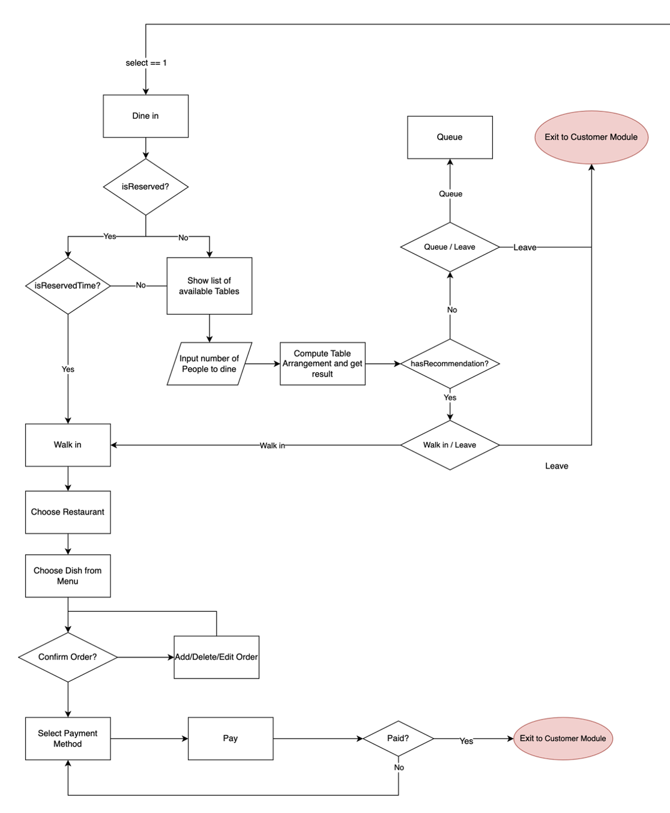
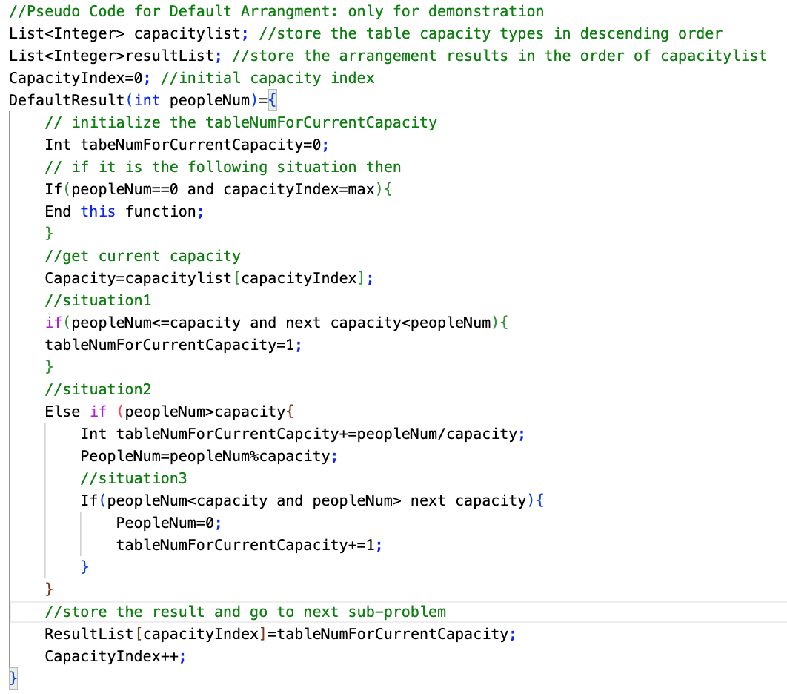

## **CS3343 Software Design Group12**

# *GoGoEat Food Court Reservation System*

# **1. Introduction**

GoGoEat is a Food Court Management System aiming at various target users, including customers, merchants, and admin of the food court. 

For customers, GoGoEat consists of a dine-in system and an online queuing service to allow customers to queue in the application. The online queuing service would prevent customers from getting worried about missing turns and prevent potential crowds from gathering outside the restaurant while queuing physically. 

On the other hand, merchants can edit restaurants’ information, including editing dish information. Merchants can also help to check customers’ orders and further process cash payments through GoGoEat.

Food court admin can set the opening hours of the food court, which would restrict the available time slots for reservations, check customers’ orders and reservation status, and edit restaurants’ and tables’ information.

The major components and functionalities of GoGoEat:

1. Customer Module
	* Login & Register
	* Dine-in (including Online Queuing)
	* Reservation
	* Food Ordering
2. Payment
	* Pay by Cash
	* Pay by Online Payment Methods
3. Merchant Module
	* Login & Register
	* Edit Dish Information
	* Check Customers’ Orders
	* Cash Payment for Customer
4. Admin Module
	* Set Food Court’s opening hours
	* Check Customers’ orders
	* Check Customers’ reservation status
	* Add / Remove Restaurants
	* Add / Remove Tables
5. Tables Management
6. Time Management

The functionalities will be further explained and illustrated in the use case diagrams and program flows.

# **2. Design Constraints**

Due to the nature of this project, multiple constraints are needed to be considered when designing. Some constraints of the GoGoEat project are listed below:

* **Scope & Time Constraint**

The project scope involves a wide range of operations for admin, merchants, and customers. It is necessary to refer to reality in many aspects and implement and improve it in formulating business logic. Hence, the project cycle is limited to 13 weeks.

* **Cost Constraint**

To better fulfill the scope requirements of the project, appropriate designs are needed. However, the resource for the project is limited due to cost constraint. Thus, the project's design needs to help save the resource for implementing and testing.

As stated above, the general design of the GoGoEat Project is as follows:

1. Fulfil the functional requirements.
2. Use object-oriented programming techniques, pay attention to design details, apply corresponding design patterns and principles, and avoid design defects.

Due to constraints, the current design has the following weaknesses:

1. No Graphical User Interfaces, and system operation is based on the command line.
2. Not designed to connect to a real database.
3. Concurrency requirements unresolved.
4. Multi-threaded design is not implemented; hence, asynchronous operations are not supported.

# 

# **3. Requirement Specifications & Use Case Diagrams**

## **3.1 Requirements of the stakeholder**

|  |  |
| --- | --- |
| Stakeholder | Requirement |
| Admin, Merchant, Customers | Log in to users’ module |
| Customers | Reserve a table to dine |
| Customers | Dine-in (Walk-in) |
| Customers | Ordering dishes |
| Merchant, Customers | Payment |
| Admin, Merchants | Check Customers’ Bill |
| Admin | Check Customers’ Reservations |
| Admin, Merchants | Modify Restaurants |
| Merchants | Modify Dishes |
| Admin | Modify Tables |

## **3.2 Use Case Diagrams**

### **3.2.1 Login**

Description: 

|  |  |
| --- | --- |
| **Use Case Name:** | **Login** |
| **Actor(s):** | **Customer / Merchant / Admin / Database** |
| **Description:**  | This use case describes the process of admins, merchants, and customers using the login module. On completion, they will be brought to their modules. |
| **Event:** | **Actor Action** | **System Response** |
|   | **Step 1:** The user selects the login option.**Step 2a:**The user chooses to register an account.**Step 2b:**The user chooses to log in.**Step 2c:**The user chooses to delete his/her account.**Step 3:**The user input the username and password. | **Step 4a:**The System validates the input information to check if it already exists. And returns a success or fail message.**Step 4b:** The System validates the input account information. And returns a success or fail message.**Step 4c:**The System finds a matching account to delete and returns a success or fail message. |
| **Postcondition:** | The user will be logged into the system. |

### **3.2.2 Dine in operation for customer**

Description:

|  |  |
| --- | --- |
| **Use Case Name** | **Dining Options** |
| **Actor(s):** | **Customer / Merchant / Database** |
| **Description:**  | This use case describes the process of merchants and customers using the Dining Options module with assistance from the database. On completion, customers can queue or dine in. |
| **Events:** | **Actor Action** | **System Response** |
|   | **Step 1:**The customer chooses to dine in.**Step 3:**The customer input the number of people to dine.**Step 5:**The customers choose to walk in and select their desired restaurant.**Step 7:**The customer can order from the menu of the restaurant chosen. Then proceed to payment.**Step 9:**The customer chooses the desired payment method and pays the bill. | **Step 2:**The system checks if the customer has a reservation and it is time for their walk-in.* Reserved walk-in: Goto Step 5
* Not reserved: Goto Step 3

**Step 4:**The system will give suggested table arrangements for the customer. If there are available tables, customers can walk in, else need to queue.**Step 6:**The list of the available restaurants will be shown.**Step 8:**The system will output the corresponding menu of the chosen restaurant.**Step 10:**The system will calculate the price of the orders by matching their customer state, i.e., VIP or SuperVIP. |
| **Postcondition:** | The customer can dine in and get their meals. |

### **3.2.3 Reservation**

Description:

|  |  |
| --- | --- |
| **Use Case Name** | Reservation |
| **Actor(s):** | Customer / Database |
| **Description:**  | This use case describes the operation where the customer can reserve the tables in the food court for the next day. |
| **Events:** | **Actor Action** | **System Response** |
|   | **Step 2:** The user input the time slot he/she wants to reserve.**Step 3:**The customer input the table id he/she wants to reserve. | **Step 1:**The system lists the available time slots for tomorrow and the table IDs.**Step 4:**The system checks the validity of the inputted time slot and table ids.**Step 5:**The System will change the status of the table inputted to reserved. |
| **Postcondition:** | The reservation information, including time slot and table id, is printed out for the customers for reference. |

### **3.2.4 Cancel Reservation**

Description:

|  |  |
| --- | --- |
| **Use Case Name** | **Cancel Reservation** |
| **Actor(s):** | Customer / Admin / Database |
| **Description:**  | This use case describes the process of the customer choosing to cancel the reservation after the system shows the reservation reminder. |
| **Events:** | **Actor Action** | **System Response** |
|   | **Step 2:**The customer cancels the reservation. | **Step 1:**The system automatically returns the reminder of customers’ reservations recorded in the database after customers log in and show a cancel reservation choice. |
| **Postcondition:** | The system returns “Cancel success!” and deletes the reservation record in the database. |

### **3.2.5 Check Out**

Description:

|  |  |
| --- | --- |
| **Use Case Name** | **Checking Out by the customer** |
| **Actor(s):** | **Customer, Database** |
| **Description:**  | This use case describes the operation where table status can change from occupied to available by the check-out function of the customer. |
| **Events:** | **Actor Action** | **System Response** |
|   | **Step 1:**The customer chooses to check out after finishing dining. | **Step 2:**The system will obtain the occupied tables from the customer.**Step 3:**The system will change the status of the occupied table of the customer to available. |
| **Postcondition:** | The customer will get the success message from the system and can leave the food court. |

### 

### **3.2.6 Check Order for admin and merchant**

Description:

|  |  |
| --- | --- |
| **Use Case Name** | **Checking customers’ order by the Admin** |
| **Actor(s):** | **Admin, Database** |
| **Description:**  | This use case describes the operation of the admin where they can check the orders made by the customer regardless of the restaurants of the orders through inputting customer id. |
| **Events:** | **Actor Action** | **System Response** |
|   | **Step 1:**Admin enters the module and inputs the customer id. | **Step 2:**The database will find a matched customer instance from the id.**Step 3:**The system will check if there are any orders made by the customer and print the information for the admin. |
| **Postcondition:** | The admin can obtain the orders made by the customer by the customer id. |

### 

### **3.2.7 Check Reservation**

Description:

|  |  |
| --- | --- |
| **Use Case Name** | **Check Customers’ Reservation by the Admin** |
| **Actor(s):** | **Admin, Database** |
| **Description:**  | This use case describes the operation where the admin can check the reservation information of the customer to help them to check in for the reservation. |
| **Events:** | **Actor Action** | **System Response** |
|   | **Step 1:**Admin enters the module and inputs the customer id to check the reservation information of the customers. | **Step 2:**The database will find a matched customer instance from the id.**Step 3:**The system will check if there is any reservation information stored in the customer and print the information for the admin. |
| **Postcondition:** | Admin can obtain the relevant reservation information of the customer by the customer id. |

### **3.2.8 Dish Manipulation**

Description:

|  |  |
| --- | --- |
| **Use Case Name** | **Dish Manipulation by the merchant** |
| **Actor(s):** | **Merchant, Database** |
| **Description:**  | This use case describes the operation where merchants can edit dish name or price, add dish, or remove dish from the menu of the restaurant owned by the merchant. |
| **Events:** | **Actor Action** | **System Response** |
|   | **Step 1a:**Merchants choose to edit the dish name or price, and input the numbering of the dish.**Step 1b:**Merchants choose the add dish operation,**Step 1c:**Merchants choose the remove dish operation**Step 3ai:**Merchants choose to edit the dish name.**Step 3aii:**Merchants choose to edit dish price.**Step 3b:**Merchants input the name of the new dish.**Step 3c:**Merchants input the numbering of the dish. | **Step 2:**The system finds a dish instance match from the inputted numbering.**Step 4ai:**The system changes the name of the dish.**Step 4aii:**The system changes the price of the dish**Step 4b:**The system adds the dish instance by the name.**Step 4c:**The system removes the dish instance by the corresponding numbering. |
| **Postcondition:** | The merchant will receive a success message if the chosen operation is completed successfully. |

### 

### **3.2.9 Table Manipulation**

Description:

|  |  |
| --- | --- |
| **Use Case Name** | Table Manipulation by the Admin |
| **Actor(s):** | Admin, Database |
| **Description:**  | Use case describes the operations of admin adding or removing tables.  |
| **Events:** | **Actor Action** | **System Response** |
|   | **Step 1a:**Admin chooses to add table.**Step 1b:**Admin chooses to remove table.**Step 3a:**The admin input the table ID and the capacity.**Step 3b:**The admin input the table ID of the table. | **Step 2:**The system prompts the admin to input the information.**Step 4a:**The system will add the new table instance by the inputted table ID and capacity.**Step 4b:**The system will remove the table instance by the table ID. |
| **Postcondition:** | The admin will receive a success message if the chosen operation is completed successfully. |

### **3.2.10 Restaurant Manipulation**

Description:

|  |  |
| --- | --- |
| **Use Case Name** | **Restaurant Manipulation by the Admin** |
| **Actor(s):** | **Admin, Database** |
| **Description:**  | This use case describes the operations where the admin can add restaurants or remove restaurants from the database. |
| **Events:** | **Actor Action** | **System Response** |
|   | **Step 1a:**Admin chooses to add restaurant**Step 1b:**Admin chooses to remove restaurant**Step 3:**The admin input the name of the restaurant that he wants to add or remove. | **Step 2:**The system prompts the admin for input.**Step 4a:**The database will add the restaurant instance by name.**Step 4b:**The database will first match the instance to the inputted restaurant name, then remove the restaurant instance. |
| **Postcondition:** | The admin will receive a success message if the chosen operation is completed successfully. |

### 3.2.11 Payment

Description:

|  |  |
| --- | --- |
| **Use Case Name** | **Payment** |
| **Actor(s):** | **Customer / Merchant / Admin / Database** |
| **Description:**  | This use case describes the process of admins, merchants, and customers using the payment module with an assist from the database. On completion, customers or merchants can proceed and complete the payment. |
| **Events:** | **Actor Action** | **System Response** |
|   | **Step 1:** The use case isinitiated when the customer selects the payment option.**Step 2a:**The customer chooses to pay by cash. His/her dining bill will pass to the merchant by inputting the merchant id.**Step 2b:**The user chooses to pay with online payment methods. He/she chooses the payment method. | **Step 3a:**The merchants can extract the information of the customers’ bills and help to proceed with the payment by cash. By completion, return confirmation of completion.**Step 3b:**The customers pay through the online payment gateway. By completion, return notice of completion. |
| **Postcondition:** | The customer can pay their bills. |

# 

# **4. Class Diagram**

The overview of the class diagram:

The clear PDF version of the class diagram is attached in the Doc folder, named ***ClassDiagram.pdf***.

## 

# 

# **5. Design Principles and Patterns**

## **5.1 Design Principles**

Example 1: 

Satisfying Open-closed Principle (OCP) and Liskov Segregation Principle (LSP)

Description: 

The admin class plays the role of the invoker, using the command interface to run commands for the admin. The ***commandAdmin*** class is an abstract class, which obtains resources that an admin’s command may need, and an abstract execution function is also in it and allows its subclasses to implement. Detailed commands were then implemented by its subclasses, respectively.

Example 2: 

Satisfying Single Responsibility Principle (SRP) and Dependency Inversion Principle (DIP)

Description: 

***Payment*** uses the interface of payment methods which was implemented by their single payment methods in a single responsibility. A payment factory interface was used by the payment methods interface. Three payment factory classes were used to implement the factory interface to avoid incorrect dependencies and make future extensions easier.

## 

## **5.2 Design Patterns**

1. State Pattern

Description: 

In this structure, the ***Customers*** class has ***CustomerState*** class which is used to decide the customer's state according to his bill amount. If the bill amount reaches a certain level, the customer's state will become SuperVIP and get a corresponding discount. Otherwise, he will be just the VIP state without any discount. This pattern allows the customer to transition between different states.

1. Strategy Pattern
 
Description:

In this structure, strategy pattern is used, which is similar to a state pattern. The strategy pattern is to define a family of algorithms, encapsulate each one, and make them interchangeable. 

1. Singleton Pattern

Description:

We adopt a singleton pattern in the ***Admin*** class. There will be only one instance created for ***Admin*** class, and only the admin has the highest authority to check relevant information.

1. Factory-method Pattern

Description: 

This structure uses a factory-method pattern. ***PayFactory*** class is the creator, and concrete payment factories such as ***WechatFactory***, ***AlipayFactory*** will implement this interface. Different factories will connect to concrete payment methods. And in the running time, objects can be created dynamically.

1. Observer Pattern

Description: 

This structure uses the observer pattern. As ***ManualClock*** class changes the time, it will notify its observers—***TableManagement*** class and ***Customers*** class to update, and each observer will call back to the object. And the information will be updated correspondingly.

# **6. Program Flow & Algorithms**

## **6.1 Program Flow**

There are three main user modules for the GoGoEat - Food Court Management System, as shown below:

* Customer Module
* Admin Module
* Merchant Module

There are some common operations that apply to all customers, admin, and merchant modules, that is the login and logout function.

**Login Operation:**

Description: 

For the login module, users can choose to register a new account, delete their account, or log in. For the login, users will be required to input their username and password, if there is a match of account found in the database, they can log in successfully.

**Logout Operation:**

Description:

All the users can access the logout function. By choosing the logout function, they will exit their corresponding user modules and return to the main. After that, they can log in again.

### **6.1.1 Customers’ Flow**

An overview of customers’ flow:

Description:

The customer module includes five operations that can be done by the customers in the GoGoEat System. The five operations are dine-in, reserve, cancel reservation, check out, and logout.

**Dine-in operation:**

Description:

In the dine-in operation, only the customers who have not yet sat down can enter the flow. Then the system will check if the customer has a reservation. If there exists a valid reservation for the customer, and it is now time for them to walk in for the reserved time slot, they can directly walk in to dine and start ordering.

For those who are not reserved, they need to input the number of people to dine into the system, the system will then assign tables according to the inputted number of people. There are enough available tables for the number of people to dine so that the system will provide table arrangements for them. The customer can choose to accept the arrangement and walk in or choose to leave.

If there are not enough available tables, there will be no suggested table arrangements, and the customer needs to queue up to wait for the dining customers to check out.

After walking in, the customer will need to choose from the list of restaurants and the dish from the menu of the restaurant chosen. The ordered dish will first be added to the list of pending orders and is not yet to be confirmed to order. After ordering, the system will prompt the customers if they want to confirm the pending orders made previously. If the customers do not confirm the order, they can always go back to add or remove the dish ordered, and the pending orders will be updated after each modification. After confirmation, the pending orders will be officially ordered and added to the customers’ list of official orders.

Finally, after ordering, the customers can proceed to the payment.

**Reservation Operation:**

Description:

For the reservation process, the system will check on the customers on whether they already have a valid reservation. The customers who are already reserved cannot reserve again.

If there are no existing reservations for the customer, they will be prompted with a list of tables, including table id, together with the available time slots for tomorrow. The customer will input their desired table id and time slots for reservation.

However, there are also some constraints for the reservation regarding the duration and format as listed below:

* Duration of the reservation must be longer than 30 minutes and less than 2 hours
* The input format of the reservation time slot is xx:xx-xx:xx (without any spaces)

After successful reservation, the program will prompt a success message to notify the customers.**Cancel Reservation Operation:**

Description:

For canceling the reservation, this function will only be accessed when the customer has an existing valid reservation. To cancel the reservation made, the customer will enter this operation, and the table status will change from reserved to available, and the reservation information stored in the customer will be cleared.

**Check-Out Operation**

Description:

Whenever the customer finishes dining and plans to leave, they need to log in to the system to check out. By choosing to check out, the table status will change from occupied to available, and the table can be assigned to other customers in the queue.

### 

### **6.1.2 Merchants’ Flow**

An overview of the merchants’ flow:

Description:

There are three main operations for the merchants, which are modifying the menu of the restaurants that they belong to, checking customers’ orders, and logout.

**Modify Menu Operation:**

Description:

For modifying the menu, the merchant can choose to manipulate the menu, that is, to add dishes or remove dishes from the menu, or to edit the dish information, that is, the name and price of the dish separately.

For adding dishes, the merchants simply need to input the new name and price of the dish. Then the system will create a dish instance to be added to the menu and update the database.

To remove the dish from the menu, the system will first output the list of current dishes in the menu with the numbering. The merchants need to input the corresponding numbering of the dishes to delete. Then it will be deleted from the menu.

For editing name and price, the dish instance will be matched by the dish's name. After an instance is matched, the merchant can choose to edit the name or price and input the new name or price, then the corresponding information about the dish will be updated in the database.

**Check Customers’ Orders Operation**

Description:

For checking customers’ orders, merchants will need to input the customer id of the customer that needs to check the order. The system will first match the customer instance, and if there is a successful match, all the orders made by that customer that belongs to the restaurant owned by the merchant will be passed to the merchant and get printed out.

### 

### **6.1.3 Admin’s Flow**

An overview of the admin’s flow:

Description:

For the admin module, there are eight operations, that is changing opening hours, checking customers’ orders, checking customers’ reservations, manipulating restaurants, manipulating tables, and logout.

**Restaurants Modification:**

**Description:**

To register a new restaurant into the food court management system, the name of the restaurant is the key to matching the restaurant instance.

For adding restaurants, the name of the new restaurant is inputted, then a new restaurant instance will be created and added to the database.

To remove a restaurant from the database, the restaurant's name is inputted to match the instance. If there is a match, the restaurant can be deleted.

**Tables Modification:**

Description:

To register a new table into the food court management system, the table's id is the key to match the table instance.

For adding tables, the id of the new table is inputted. The system will check if the id already exists in the system and reject the request if there is any collision. Then a new table instance will be created and added to the database.

To remove a table from the database, the table's id is inputted to match the instance. If there is a match, the table can be deleted.

**Change Opening Hours of the food court:**

Description:

To change the opening hour of the food court, the admin will need to input the new time range in the format of xx:xx-xx:xx. The system will check if there is a time collision by checking if there are any reservation time slots crossing over the new opening hours. The change cannot be made if there is a collision. If the change is successful, the system will print out the new opening hour to notify the admin.

**Check Customers’ Orders Operation:**

Description:

For checking customers’ orders, the admin will need to input the customer id of the customer that needs to check the order. This process is similar to the order checking in the merchant module.

The system will first match the customer instance, and if there is a successful match, all the orders made by that customer will be passed to the admin and get printed out, regardless of the restaurant chosen.

**Check Customers’ Reservation Operation:**

Description:

For the checking of the reservation, similarly, the customer id is inputted by the admin to the system, and a matching instance of the customer can be found. The system will output the reservation information made by that customer if there is any. When finished, the process will return to the admin module.

## 

## **6.2 Algorithms**

### **6.2.1 TablesManagement.java**

**Objective of this section:** This includes the management functions that act on tables. It includes functions to add/remove tables, table status setting functions, reservation functions for different tables, table arrangement implementation functions, walk-in setting functions, and waiting-table setting functions.

 

**Main fields:**

* ***availableTables***: store the list of available tables
	+ type: ArrayList<Table>
* ***reservedTables***: store the list of reserved tables
	+ type: ArrayList<Table>
* ***occupiedTables***: store the list of occupied tables
	+ type: ArrayList<Table>
* ***waitingCustomers***: store the list of customers waiting for tables
	+ type: ArrayList<Customers>
* ***tableCapacityTypeList***: store the list of table capacity types
	+ type: ArrayList<Integer>

Implementation of ***waitingCustomers***: 

When the customer chooses to wait for the default arrangement, then the system will add the customer to the ***waitingCustomers*** list. Afterward, if some table(s) is released, which means some other customers check out, the system will check this list and find the customer(s) waiting for the specified tables, then add the table(s) to their occupied list. Then after the customer’s waiting tables list is empty, the system will remove the customer from the ***waitingCustomers*** list.

Implementation of ***tableCapacityTypeList***: 

This field stores all the table types in this program in descending capacity order. For example, if there are three table types(2,4,8), then the list will store the three types: 8, 4, 2. The ***tableCapacity*** will be modified in two situations. The first one is when the admin adds a new table with a capacity that is not stored in the ***tableCapacityTypeList***, then the system will automatically add the capacity to the list and sort the list to keep it in the right order. The second situation is when the admin removes a table and if, after that, the number of tables with that particular type is 0, then remove the table capacity type from this list.

**Flow graph of the TablesManagement**

**Explanation:** 

The following flow graph is for the table arrangement. After customers enter the number of people, the system will call the ***DefaultArrangementAlgorithm*** function to make arrangements according to the number of people. 

Then, the system will call the ***canDirectlyWalkIn*** function to judge whether the default arrangement is currently available. If the default arrangement is available and the customer chooses to walk in now, then it will trigger the ***setWalkInStatus*** function to set the status of the related tables and add them to the customer's occupied table list. However, if the ***canDirectlyWalkIn*** function returns false, it will first trigger the ***RecommendedTableArrangementAlgorithm*** function. If there is an optimized arrangement, then the system will let the customer choose whether to walk in with recommended arrangements or continue to wait for the default arrangements. 

 

**Main Functions 1: *DefaultArrangementAlgorithm***

Description: To make default arrangements according to the number of people and to minimize the number of tables according to the current table capacity type and the number of corresponding table types.

Output: ArrayList<Integer> ***tableArrangementResult***, this field is stored in the descending order of table capacity type.

Implementation: Generate the table arrangements by choosing the most suitable table according to the number of people.

Logics(Pseudo Code)

Detailed Implementation:

Real Usage in the program:

**Main Functions 2: *RecommendedTableArrangementAlgorithm***

Description: To make arrangements according to the currently available tables based on the principle of minimizing the usage of tables. And to provide the optimized table arrangement results when the default arrangement is not available and there exists another arrangement that allows the customer to walk in directly.

Output: ArrayList<Integer> ***tableArrangementResult***, this field is stored in the descending order of table capacity type.

Implementation: Generate the table arrangements by putting the table into a table list in the descending order of capacity

Detailed Implementation: 

Real Usage:

​​ 

**Main Functions 3:** ***CanDirectlyWalkIn*** Function

Description: Judge whether the default result can directly walk in.

Implementation:

According to the input array list:

1. iterate for each type of table and compare the number of available tables and the number of that type of table which is needed;
2. if ***canDirectlyWalkIn***: return true;
3. if not ***canDirectlyWalkIn***: print the waiting table message and return false;

Detailed Implementation:

**Main Functions 4:** ***setWalkInStatus*** Function

 

Purpose: When the customer chooses to walk in, then call this function to set walk-in status.

Implementation: 

According to the ***tableArrangementsResult***:

1. Iterate the table capacity, and see whether this capacity type is needed.
2. Find the tables with corresponding table capacity.
3. Add these table IDs to ***checkedInTableIds***.
4. Set the tables from available to occupied.
5. Return the ***checkedInTableIds***.

Detailed Implementation:

**Main Functions 5: *setWaitingTables*** Functions

Purpose: When the customer chooses to wait for the default arrangements, set occupied status for the currently available tables and add the remaining tables to the customer’s ***waitingTableNum*** List.

Implementation:

According to the ***tableArrangementsResult***:

1. Iterate the table capacity and see whether this capacity type is needed.
2. Find the tables with corresponding table capacity and add these available table ID of that type to ***checkedInTableIds***, and set the tables from available to occupied.
3. Update the ***waitingTableNumList*** for the remaining tables that are needed but currently not available.
4. Pass the ***checkedInTableIds*** to the customer's ***occupiedTableList***, and add the ***waitingTableNumList*** to the customer.

### **6.2.2 AccountsManagement.java**

Description:

At the program start, the account information will be first printed out before logging in. For the output of the accounts, it is sorted with this ***sortByValue*** function. All the accounts will be sorted by user id. The user id will first be sorted by its prefix: A, C, M. Then, it will sort by its last four digit numbers.

Effect:

# **7. Code Refactoring**

## **7.1 *TableArrangementAlgorithm.java***

**Method:** Extract Interface

Before Code Refactoring:

Description:

We have two separate methods that contain two different algorithm implementations in TableManagement class. In this situation, if we want to add a new algorithm, it will be very inconvenient and will make TableManagement class even longer.

After Code Refactoring:

Description: 

We extract the two methods into separate classes and share one common interface ***TableArrangementAlgorithm***. After this, we can feel free to add more algorithms according to our needs and won’t influence the main code structure of the ***TableManagement*** class.

## 

## **7.2 CustomerModule.java and CommandCustomerModulePrompt.java**

**Method:** Extract Class

Before refactoring:

Description:

Before code refactoring, only just two classes –***Customers*** class and ***CustomerModule*** class are set. The purpose of setting ***CustomerModule*** class is to put all of the processes related to customers in it, such as ***CustomerDineIn***, and ***CustomerCheckOut***, which means that ***CustomerModule*** class will call the functions in the ***Customers*** class. This causes the code in the ***CustomerModule*** class to be too long, making it inconvenient to maintain related functions. 

After refactoring:

Description:

We extracted functions about ***Customers*** from the ***CustomerModule*** class into ***CommandCustomerCancelReservation*** class, ***CommandCustomerCheckOut*** class, ***CommandCustomerReservation*** class, and ***CommandCustomerDineIn*** class. And we extracted the CustomerModulePrompt function from ***CustomerModule*** class, which is used to initialize the options available for customer selection. In this way, the code size in each class will be reduced, which is beneficial for maintaining the code.

## **7.3 Account Management related**

**Classes:**

* ***CommandAccountManagementDelete***
* ***CommandAccountManagementLogin***
* ***CommandAccountManagementRegister***

**Method:** Pull Up Field

Before refactoring:

Description:

Before code refactoring, the three classes have the same fields – Database and AccountManagement. 

After refactoring:

Description:

After refactoring, we put the database field and AccountManagement field into the ***CommandAccountManagement*** class. And let the three classes mentioned in “before refactoring” extend ***CommandAccountManagement*** class. 

## **7.4 Customer and Dine-in related**

**Method:** Extract Method

Classes Related:

* ***CommandCustomerDineIn.java***

Before Refactoring:

Description:

Originally, the ***addCheckInAndWaitingInfo*** function includes two operations that are not related. If the two operations are written in one function, then we cannot perform separate operations. Therefore, this function can be separated into two sub-functions.

After Refactoring:

Description

After refactoring, the ***addCheckInAndWaitingInfo*** is separated into addCheckInInfo and addWaitingInfo. Hence, we can do each operation separately and reduce cohesion in between.

## **7.5 Payment-Related**

**Method:** Better Naming

We did this throughout the refactoring processes and abandoned some bad naming variables that are named.

Before refactoring:

Description: 

Before refactoring, the different payment methods, for instance, pay by cash, pay by Alipay, and pay by WeChat Pay, are named ***PaymentCommand1***, ***PaymentCommand2***, and ***PaymentCommand3***, which are very confusing, and may cause misunderstanding in development afterward.

Description:

In ***Payment.java***, the three payment commands are executed, but there is no way that we know what it is actually doing by looking at the names only.

After Refactoring:

Description: 

The different payment methods had been renamed to ***CommandPaymentAlipay***, ***CommandPaymentCash***, and ***CommandPaymentWeChatPay***.

Description:

After refactoring, it is easier to understand what methods are used for payment in the ***Payment*** Class.

End of Report

